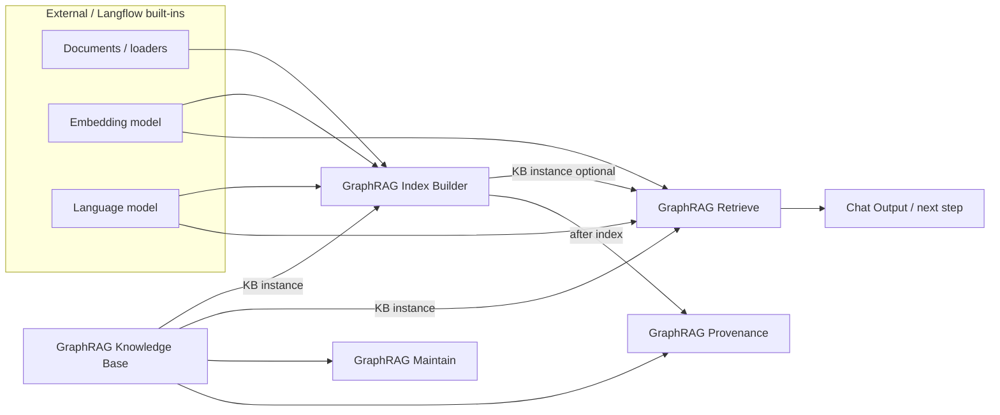

# GraphRAG usage overview

How the five Liam GraphRAG components fit together: roles, who connects to whom, and typical flows.

UI names match Langflow (English). Search **Liam** or **GraphRAG** in the component panel.

## Component map

| Component | Role | Upstream (inputs) | Downstream (outputs) |
|-----------|------|-------------------|----------------------|
| **GraphRAG Knowledge Base** | Create/connect storage (AstraDB or ArangoDB); emit a shared **KB instance**. UI shows only the selected backend’s fields | Config only (backend, prefix, credentials, ANN flags) | **KB instance** → Index Builder / Retrieve / Maintain / Provenance |
| **GraphRAG Index Builder** | Chunk → extract graph → communities → reports → vectors/ANN | KB instance, documents, Embedding, LLM | **KB instance** (indexed) → Retrieve / Provenance; **Build summary** → inspect |
| **GraphRAG Retrieve** | Local / Global / DRIFT search + answer/context | KB instance (indexed), Embedding (Local/DRIFT), LLM (Global/DRIFT; Local answers), Query | **Results**, **Answer / context** → Chat Output / agents |
| **GraphRAG Maintain** | Stats or clear KB (destructive) | KB instance; clear needs phrase `CONFIRM DELETE` | **KB instance**, **Operation result** |
| **GraphRAG Provenance** | Entity ↔ text unit ↔ document grounding | Indexed KB instance + lookup key/direction | **Provenance result**; KB pass-through |

Hub of the design: the **KB instance** (`Data` handle). Everything else plugs into it.



## Run order (mental model)

1. **Connect storage** — run Knowledge Base once; status should say connected / empty / ready.  
2. **Index** — run Index Builder (first time: **Rebuild index**).  
3. **Ask** — run Retrieve on the same prefix + **same Embedding** as indexing.  
4. **Optional** — Provenance to verify sources; Maintain for stats or wipe.

Indexing and retrieve can live in **one flow** or **two flows**, as long as they share the same backend settings and collection prefix.

## Flow A — Index (build side)

```text
[Document loader / Text Input / …]  ──documents──┐
[Embedding model]  ─────────────────────────────┼──► [GraphRAG Index Builder] ──► Build summary
[Language model]   ─────────────────────────────┤              │
[GraphRAG Knowledge Base] ──KB instance─────────┘              │
                                                               ▼
                                                         KB instance (ready)
                                                         (wire to Retrieve if same flow)
```

| Wire | From → To |
|------|-----------|
| KB instance | Knowledge Base → Index Builder |
| Documents to index | Any `Data` / `DataFrame` / `Table` source → Index Builder |
| Embedding model | Embeddings component → Index Builder |
| Language model (LLM) | LLM component → Index Builder |

**Suggested first-run settings**

- Indexing method: **Standard GraphRAG** (quality) or **FastGraphRAG** (cheaper/faster)  
- Write mode: **Rebuild index**  
- Keep built-in token chunking on unless inputs are already chunked  

## Flow B — Retrieve (query side)

```text
[GraphRAG Knowledge Base] ──KB instance──┐
     (same backend + prefix as build)    │
[Embedding model]  ──────────────────────┼──► [GraphRAG Retrieve] ──► Answer / context
     (must match indexing Embedding)     │              │
[Language model]   ──────────────────────┘              ▼
                                                   Results → optional UI
```

You may also take **KB instance** from Index Builder’s output in the same canvas (after a successful build).

| Search mode | Needs Embedding | Needs LLM | Typical use |
|-------------|-----------------|-----------|-------------|
| **Local Search** | Yes | For final answers (optional off → context only) | Concrete facts / entities |
| **Global Search** | No | Yes | Theme-level / cross-community summaries |
| **DRIFT Search** | Yes | Yes | Primer from communities + Local follow-ups |

## Flow C — Maintain

```text
[GraphRAG Knowledge Base] ──► [GraphRAG Maintain] ──► Operation result
```

- Operation **Stats**: safe; shows text units / entities / communities / reports.  
- Operation **Clear knowledge base**: type exactly `CONFIRM DELETE` in **Clear confirmation phrase**, then run. Irreversible; re-index afterward.

## Flow D — Provenance (grounding check)

```text
[GraphRAG Knowledge Base] ──► [GraphRAG Provenance] ──► Provenance result
                              (after Index Builder has run)
```

| Lookup direction | Lookup key |
|------------------|------------|
| Entity → Text Units | Entity name or entity ID |
| Text Unit → Entities | TextUnit ID (e.g. from Local citations) |
| Document → Graph Elements | Document ID or title |

Use after Retrieve when you want to prove an answer is tied to source text.

## Shared rules (avoid common mistakes)

1. **Same collection prefix + database** on Knowledge Base for build and retrieve.  
2. **Same Embedding model** for Index Builder and Local/DRIFT Retrieve (dimension mismatch breaks or degrades search).  
3. Retrieve before indexing → empty / weak results; Index Builder first.  
4. After enabling Arango vector indexes or changing Embedding, prefer **Rebuild index** once.  
5. Clear requires `CONFIRM DELETE`; old Chinese phrase `确认清空` still works in code but the UI asks for English.

## Who is optional?

| Component | Required for Q&A? |
|-----------|-------------------|
| Knowledge Base | Yes |
| Index Builder | Yes (at least once per corpus) |
| Retrieve | Yes (to ask questions) |
| Maintain | No (ops) |
| Provenance | No (audit / debugging) |

## Related pages

- Per-component detail: [Knowledge Base](../components/graphrag-kb.md), [Index Builder](../components/graphrag-build.md), [Retrieve](../components/graphrag-retrieve.md), [Maintain](../components/graphrag-maintain.md), [Provenance](../components/graphrag-provenance.md)  
- Short first-run checklist: [quickstart.md](quickstart.md)  
- Arango ops: [arango.md](arango.md)
